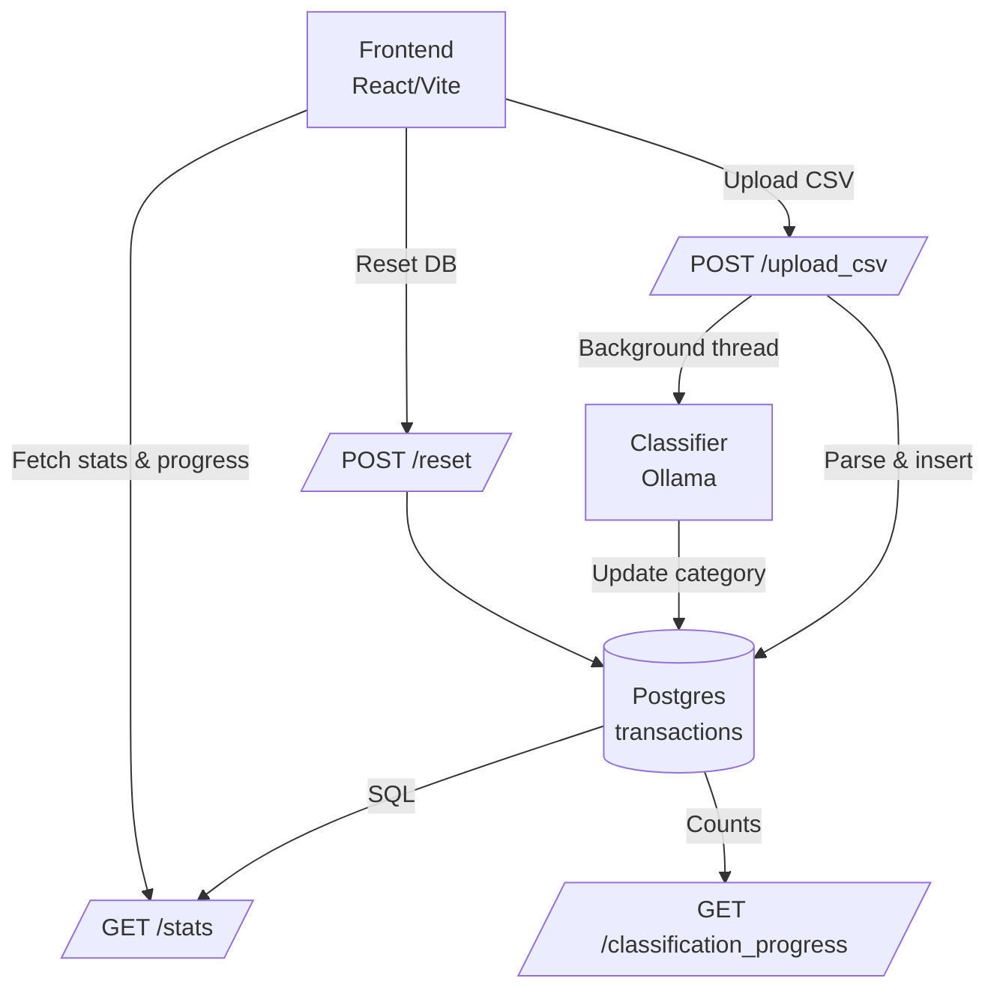

# Architecture

**Notes**
- Classification runs in a background thread; `/classification_progress` reports running state and counts.
- `/stats` aggregates totals, categories, duplicates, 30d activity, monthly trend, and recurring merchants in SQL.
- CSV ingest normalizes dates/amounts before insert, then triggers classification.
